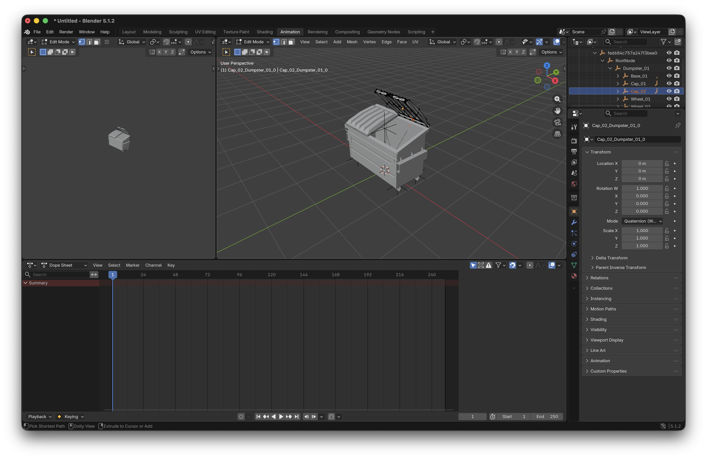

# OpenRCT2 Scenery Generator Tutorial
## Animated Small Scenery (Basic)

### 1. Start with the dumpster example

It's recommended to follow [this guide](small-scenery-advanced-tutorial.md) to set up the dumpster example. We'll be animating the lid to demonstrate basic keyframe animations.

### 2. Open the Animation Editor

In the top bar, click `Animation`:

Then in the `Outliner` panel in the top-right, expand the nodes until you can select `Cap_02`.

### 3. Keyframe Base Orientation

For each object that is going to be moving in the scene, we need to keyframe the beginning, intermediate, and ending positions.

While `Cap_02` is still selected, 