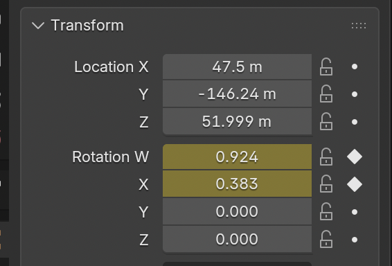
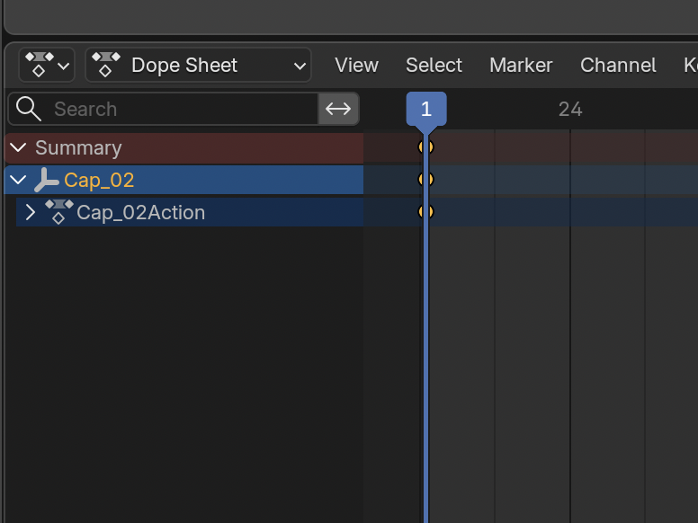
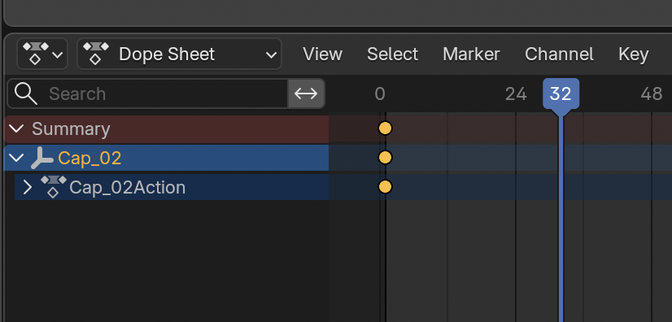
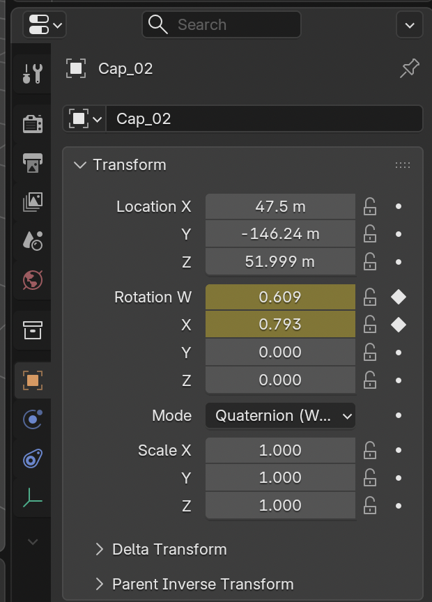
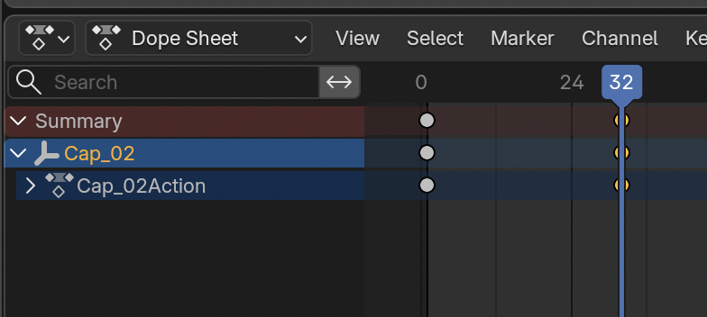
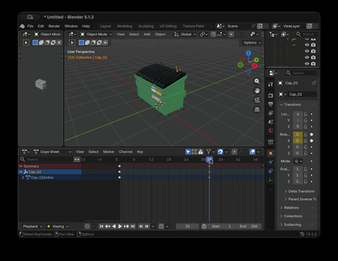
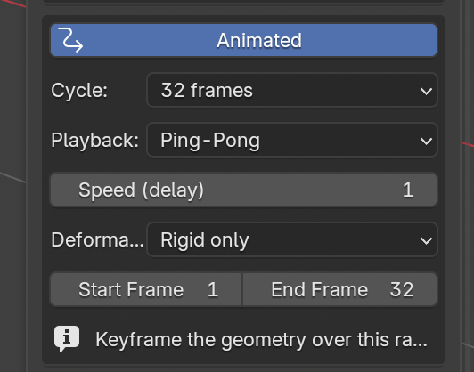
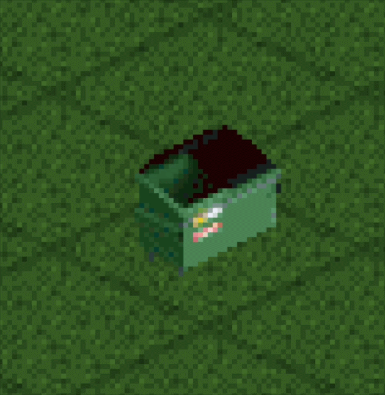

# OpenRCT2 Scenery Generator Tutorial
## Animated Small Scenery (Basic)

### 1. Start with the dumpster example

It's recommended to follow [this guide](small-scenery-advanced-tutorial.md) to set up the dumpster example. We'll be animating the lid to demonstrate basic keyframe animations.

### 2. Open the Animation Editor

In the top bar, click `Animation`:

Then in the `Outliner` panel in the top-right, expand the nodes until you can select `Cap_02`.

### 3. Keyframe Base Orientation

For each object that is going to be moving in the scene, we need to keyframe the beginning, intermediate, and ending positions.

While `Cap_02` is still selected, open the `Object Properties` panel, and in the `Transform` section click the small dot next to `Rotation W` and `Rotation X` to set the initial keyframes:

You should see the keyframes appear in the Animation editor at the bottom:

### 4. Set Next Orientation & Keyframes

Since OpenRCT2 expects animations to be in powers of 2 (i.e. 8, 16, 32), we'll move the scrubber to frame 32:

Then, back in the `Transform` section, we'll set `Rotation W = 0.609` and `Rotation X = 0.793`, then click the diamonds to set the next keyframe:

And like before, you should now see these keyframes in the Animation editor:

If you move the scrubber between frames 1 and 32, you should see the lid open and close!

### 5. Configure Add-On

Back in the `Layout` editor, open the plugin by pressing `N`.

You now want to click the `Animated` button, which will turn blue and expose a new area:

We'll use the following settings:

- `Cycle`: 32 frames
- `Playback`: Ping-Pong - this will have the lid close and then open again, returning back to the original position.
- `Speed`: 1
- `Deformation`: Rigid only - this is because the transformations we are animating do not deform any of the object meshes.
- `Start Frame`: 1
- `End Frame`: 32

### 6. Export and Test In-Game

Press the `Export .parkobj` button, save the file and add it to your objects folder. Then select and build it in-game:

