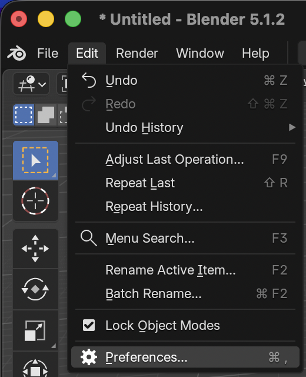
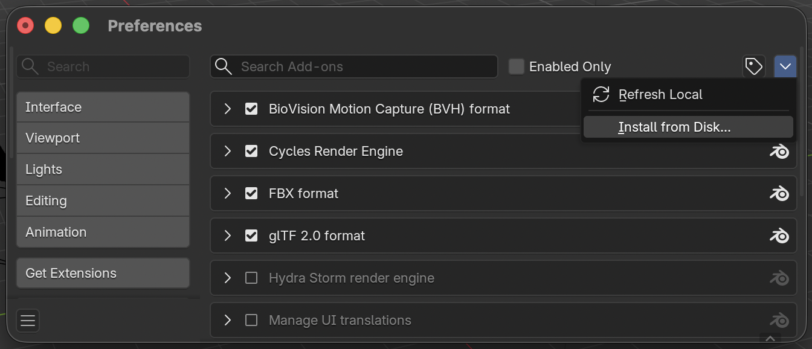

### Installing the OpenRCT2-SceneryGenerator Blender Add-On

1. Download the latest version of add-on [here](https://github.com/alex-parisi/OpenRCT2-SceneryGenerator/releases/latest) for your respective platform (Windows/macOS/Linux).
2. Open Blender
3. Go to File --> Preferences:

   

4. On the left side panel, click "Add-ons", then click the downwards pointing arrow in the top-right and select "Install from Disk":

   

5. Select the `.zip` file you downloaded in Step 1.
