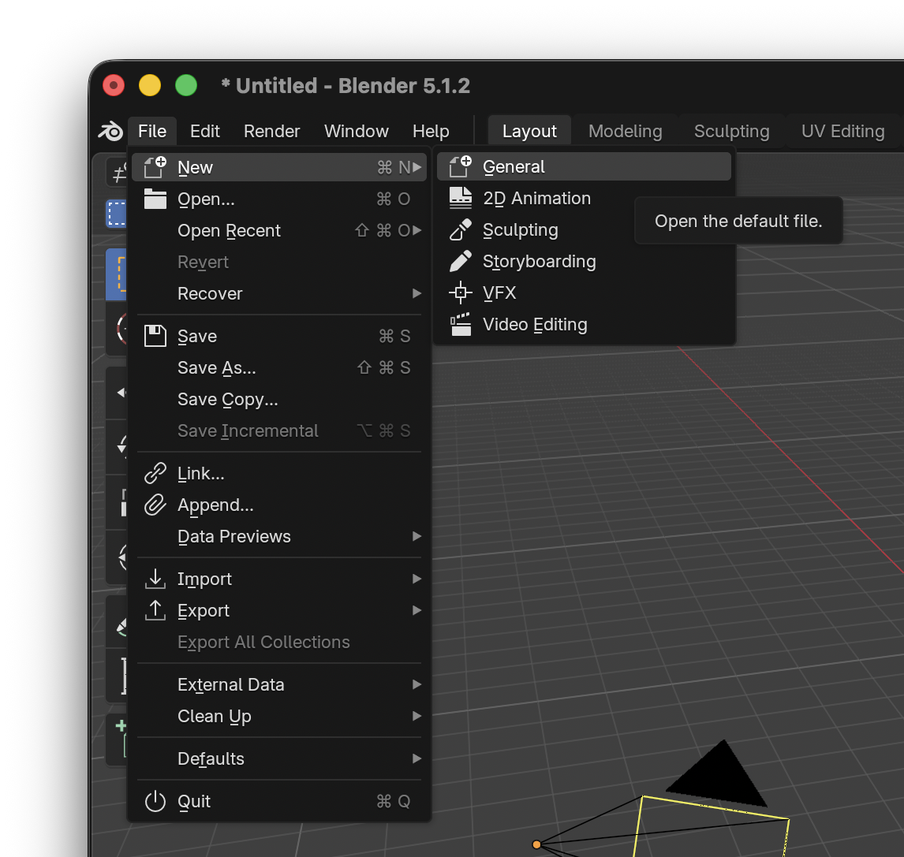
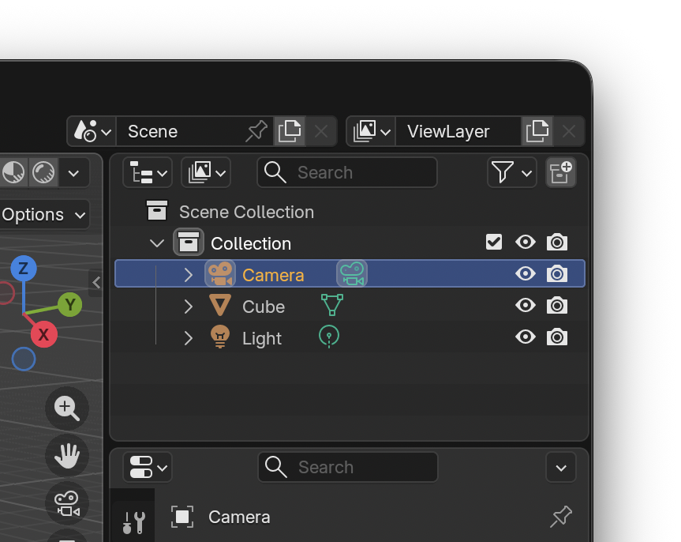
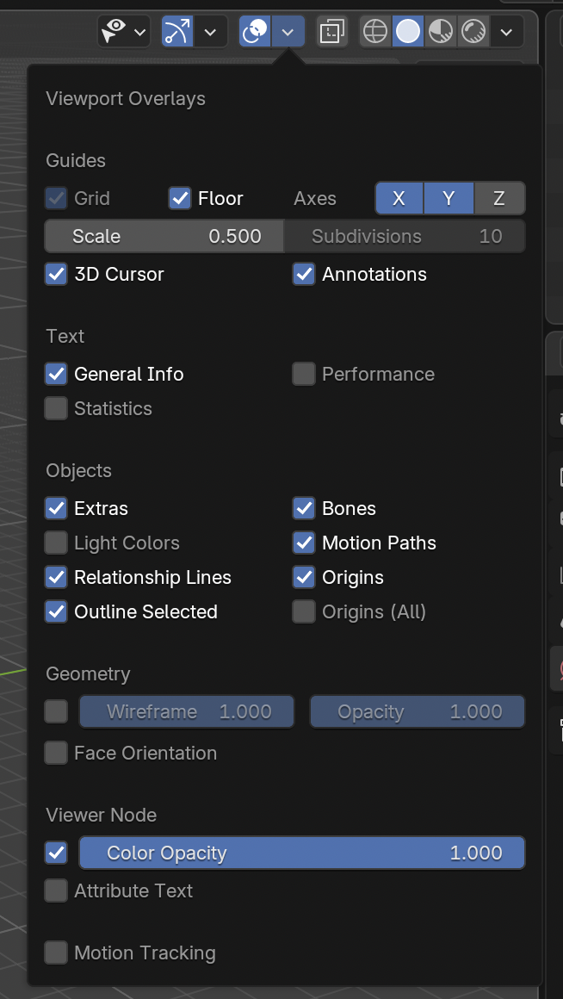
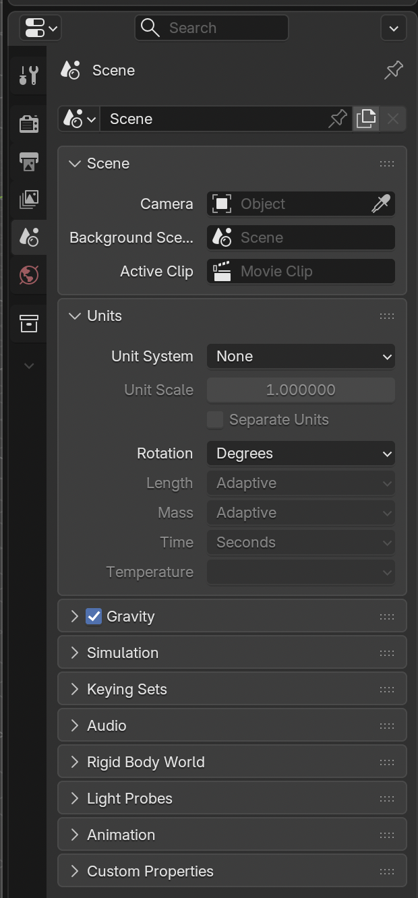

# Setting Up the Blender Scene for OpenRCT2-SceneryGenerator

 

### 1. Create a new General scene:
`File --> New --> General`

### 2. Clear the scene:
The empty General scene contains three things in the default collection `Collection`:
- Camera
- Cube
- Light

Delete all three by clicking each in the `Outliner` in the top-right corner of the Blender window and pressing `X`:

### 3. **(optional)** Configure Grid & Units

I recommend using the `1 unit = 1 tile` scaling when designing scenery objects, as it's easier to visually see the scale of the object

Before we get started, we'll configure the default grid size and the units.

In the `Layout Editor`, click the drop-down button next to the `Viewport Overlays` button:

And ensure that the `Scale` field is set to `0.5`.

Then, in the `Properties` panel on the right, select `Scene Properties` (the cone and circle icon):

Under the `Units` panel, ensure the `Unit System` field is set to `None`.
