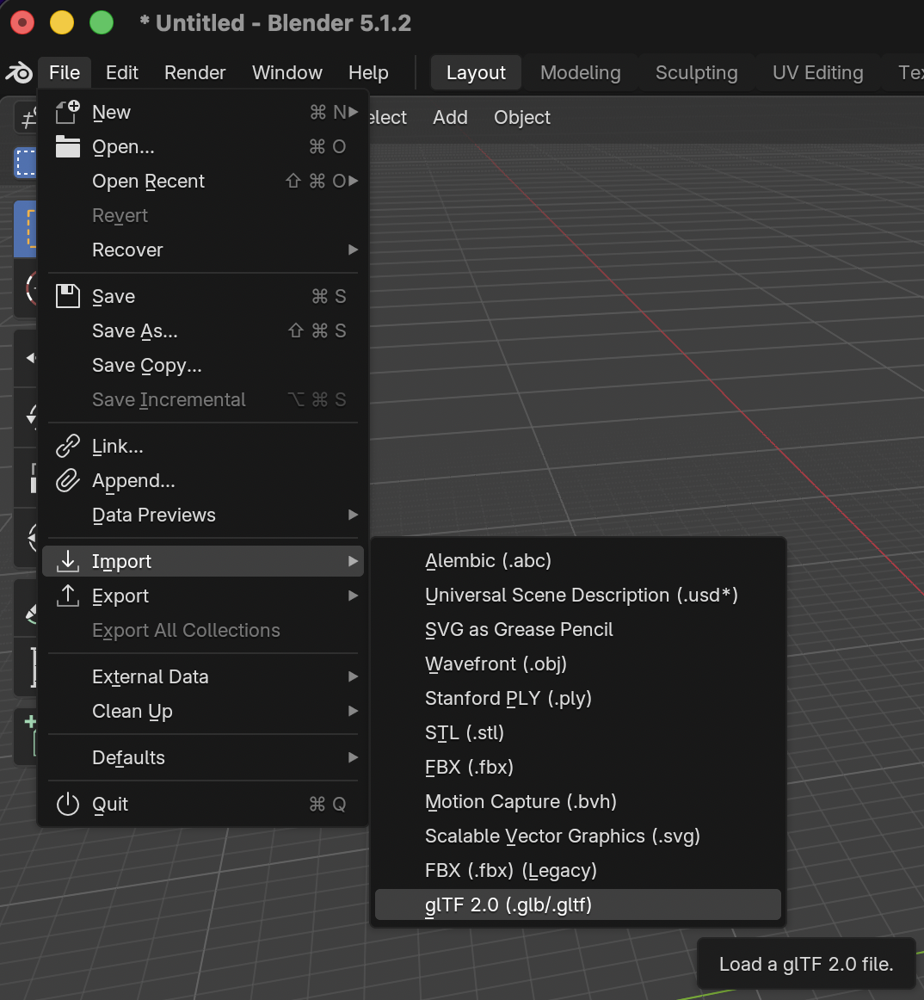
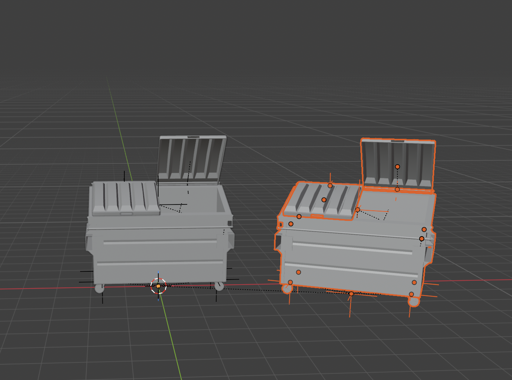
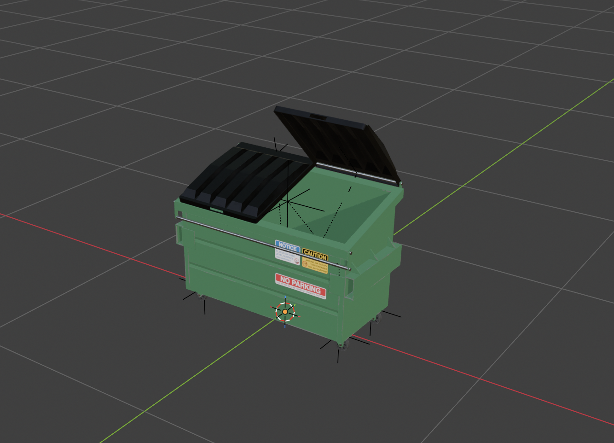
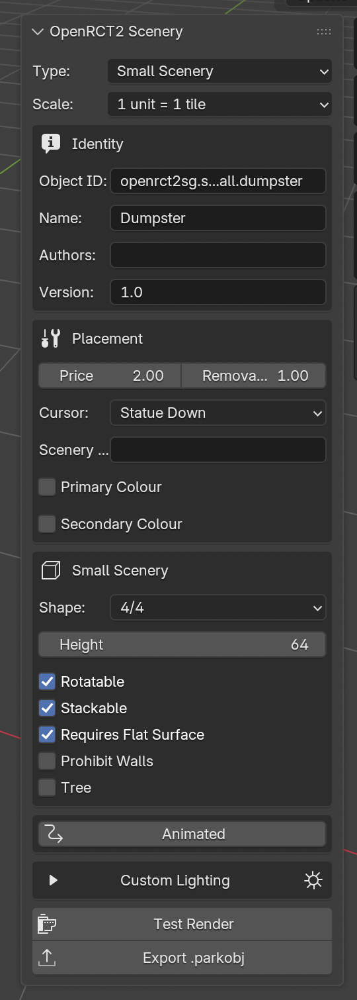
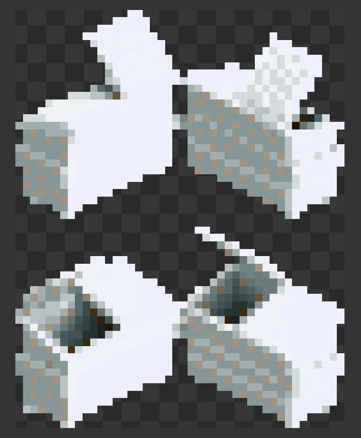
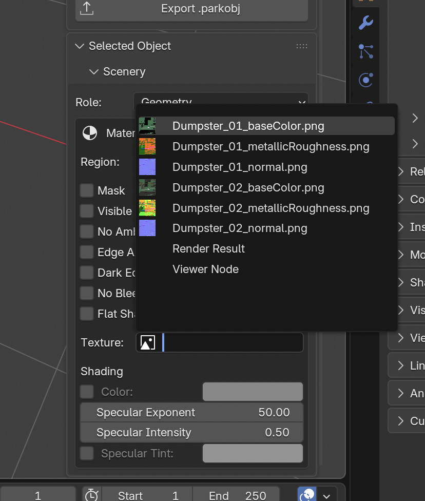
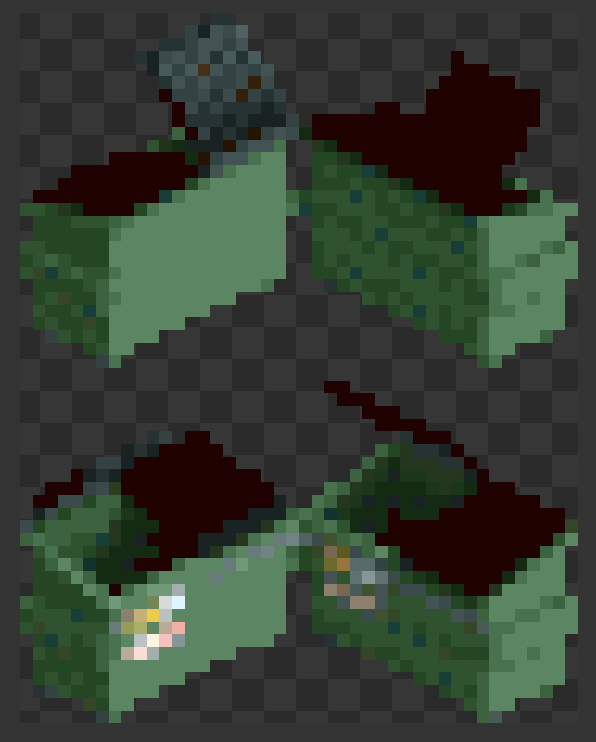
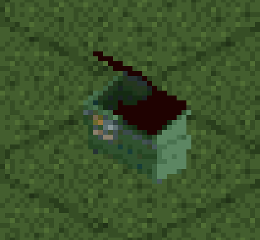

# OpenRCT2 Scenery Generator Tutorial
## Small Scenery (Advanced)

### 1. Start with an empty scene

It's recommended to follow [this guide](blender-scene-setup.md) to set up an empty Blender scene.

### 2. Import the .obj file

For this tutorial, we'll be using the files in [examples/blender/dumpster](../examples/blender/dumpster). This model was chosen specifically for this tutorial to exercise certain important details about how this add-on works.

Import `scene.gltf`:

This scene contains two dumpsters, so we'll delete the second dumpster and just keep the centered one. Select it, and press `X`:

### 3. Resize the Dumpster

We'll also switch to the `Material Preview` by pressing `Z`, and then `2`.

Like the [basic tutorial](small-scenery-basic-tutorial.md), we want to resize the dumpster to be centered in a 2x2 grid region (since each grid is 1/2 a tile):

### 4. Open Add-On and Populate Basic Settings

Now, in the `Layout Editor`, press `N` to bring up the N-Panel, and then select `OpenRCT2`.

Like the [basic tutorial](small-scenery-basic-tutorial.md), we'll populate it with the following information:

- **Type:** Small Scenery
- **Scale:** 1 unit = 1 tile
- **Object ID:** openrct2sg.scenery_small.dumpster
- **Name:** Dumpster
- **Version:** 1.0
- **Price:** 2.0
- **Removal Price:** 1.0
- **Cursor:** Statue Down
- **Shape:** 4/4
- **Rotatable:** Yes
- **Stackable:** Yes
- **Requires Flat Surface:** Yes

Then, press `Test Render`:

This is because we have not assigned the texture to the material yet! Remember, the Blender renderer is not used here, so the material settings in Blender do not map to the X7 renderer. We have to set the textures manually.

### 5. Assign Texture to Material

This mesh only has one material that has a texture mapped to it.

Press `A` to select everything, and then go to the `Selected Object` panel. If the panel doesn't open, click the dumpster first, then press `A`.

In the `Selected Object` panel, ensure that the `Role` is set to `Geometry`. Then, in the `Texture` box, click it and select `Dumpster_01_baseColor.png`:

Then, press `Test Render` again:

Looks good!

### 6. Export .parkobj and use In-Game:

Press the `Export .parkobj` button, and then save the file to a known location. Then move this file into your OpenRCT2 objects folder.

- On macOS, this will be `~/Library/Application\ Support/OpenRCT2/object`

Launch the game, and it should be available as an option in the Object Selection menu.

