# OpenRCT2 Scenery Generator Tutorial
## Small Scenery (Basic)

### 1. Start with an empty scene

It's recommended to follow [this guide](blender-scene-setup.md) to set up an empty Blender scene.

### 2. Import the .obj file

For this tutorial, we'll be using the files in [examples/blender/toilet](../examples/blender/toilet). This model was chosen specifically for this tutorial to exercise certain important details about how this add-on works.

Import `toilet.obj`:

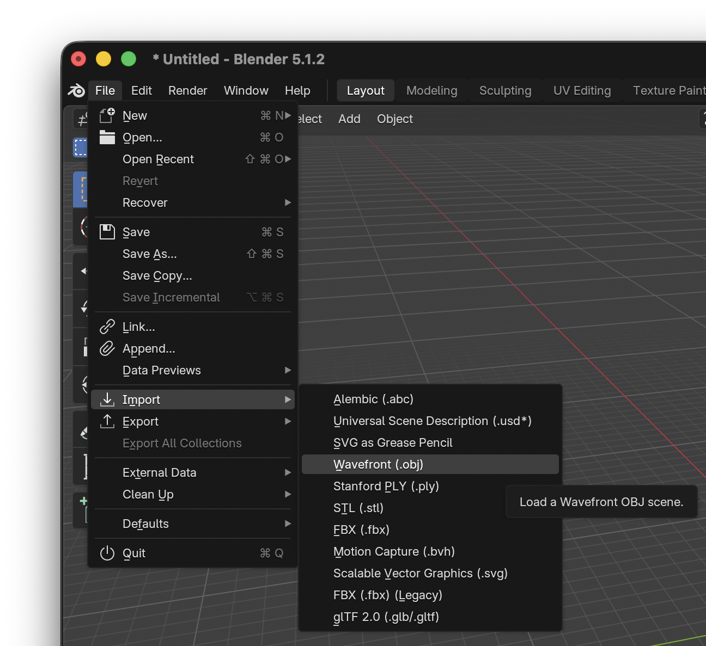

Notice how this toilet appears black.

### 3. Open Add-On and Populate Basic Settings

Now, in the `Layout Editor`, press `N` to bring up the N-Panel, and then select `OpenRCT2`:

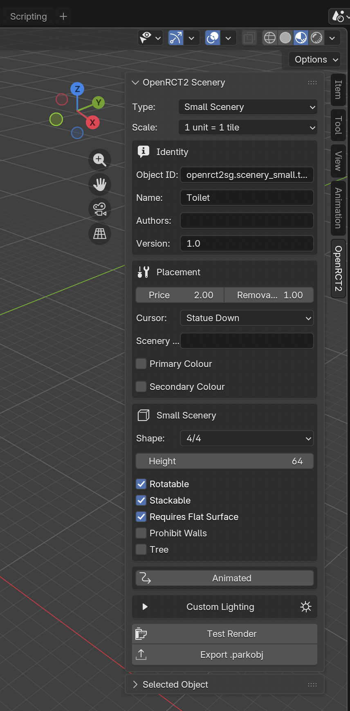

And then we'll populate it with the following information:

- **Type:** Small Scenery
- **Scale:** 1 unit = 1 tile
- **Object ID:** openrct2sg.scenery_small.toilet
- **Name:** Toilet
- **Version:** 1.0
- **Price:** 2.0
- **Removal Price:** 1.0
- **Cursor:** Statue Down
- **Shape:** 4/4
- **Rotatable:** Yes
- **Stackable:** Yes
- **Requires Flat Surface:** Yes

### 4. Generate a Test Render

First, select the toilet object.

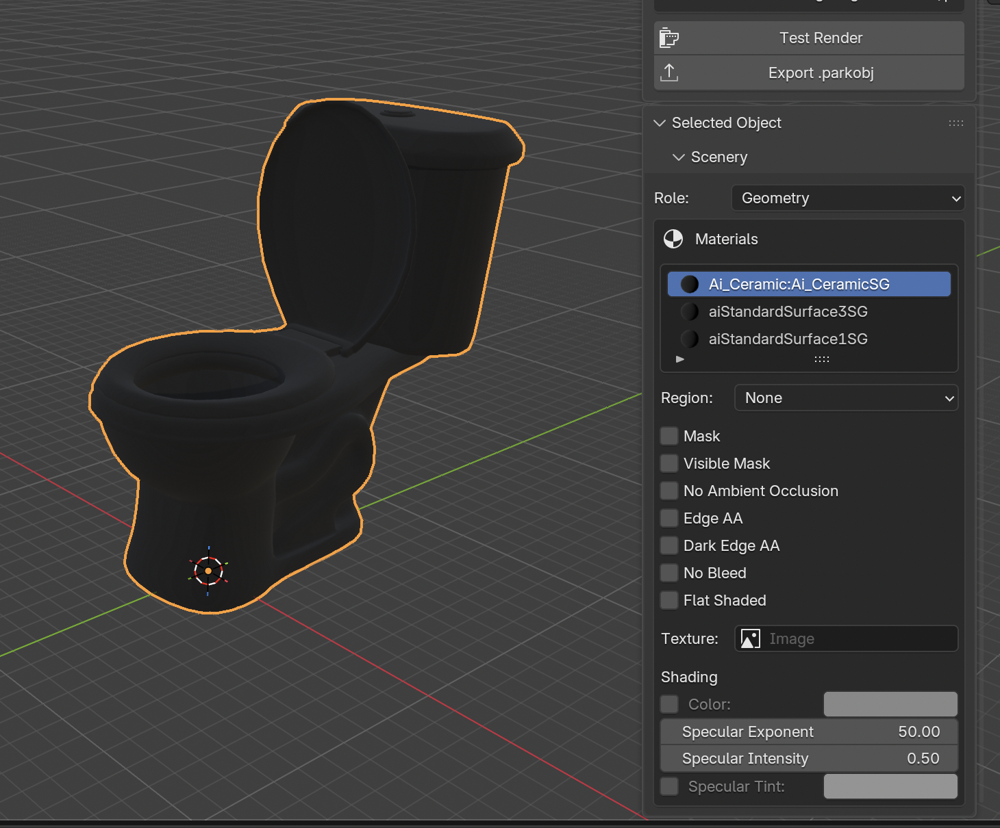

You'll see a panel below the `OpenRCT2 Scenery` panel called `Selected Object`. Here is where you can change the material settings for the underlying X7 renderer.

*Note:* the `Flat Shaded` option was vestigial and has since been removed, so ignore that setting.

It is important to remember that while Blender is used to design scenery objects, it is **NOT** used for rendering. The add-on provides all mesh data to the X7 renderer which gives us that classic ray-traced look.

The X7 renderer's material system is also isolated from the material system in Blender. This panel is where you can control the available material settings of the X7 renderer.

Just ensure that the `Role` is set to `Geometry`.

Then, open the `UV Editing` panel, and ensure that the `Show Overlays` button is not toggled. You may have to scroll horizontally over to find it:

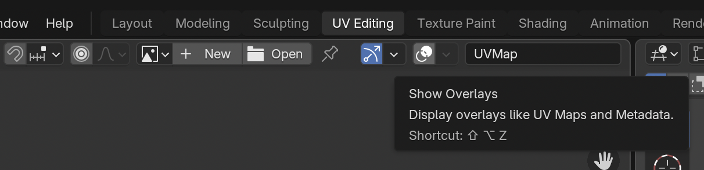

Press the `Test Render` button in the main `OpenRCT2 Scenery` panel:

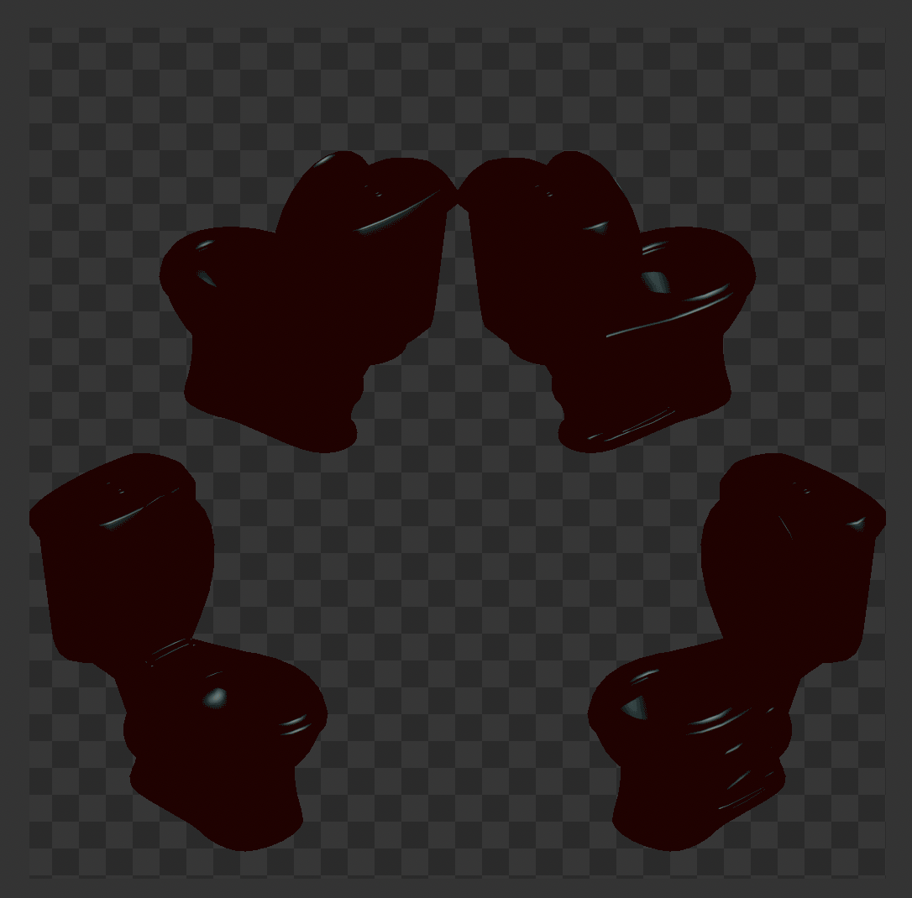

That looks awful! There are two important things to remember here:
- the scale is completely wrong, and we'll need to fix that. You can see the grid pattern on the floor of this render. Based off the first step of this tutorial, each square is 0.5 units by 0.5 units, which means we want our toilet to sit within the center of 4 squares. Right now, it's much larger than that.
- the toilet material is completely black, which looks wrong as well.

### 5. Fix Scale and Color

First, we'll rescale the toilet to the correct size. 

Back in the `Layout` editor, press `A` to select the entire toilet.

Then, select the `Item` tab in the N-Panel:

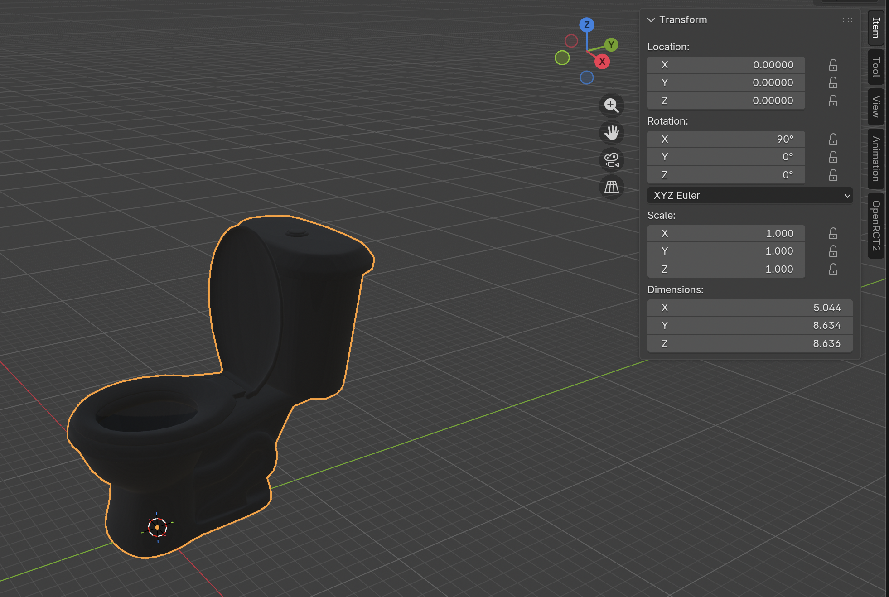

Here, we can see that the toilet size is currently 5.044 x 8.634 x 8.636 units, which is quite large for our `1 unit = 1 tile` render scale.

Press `S` to use the Scale Tool to resize the toilet, and `G` to use the Move Tool to center the toilet. We'll want it to be roughly in the center of a 2x2 tile area:

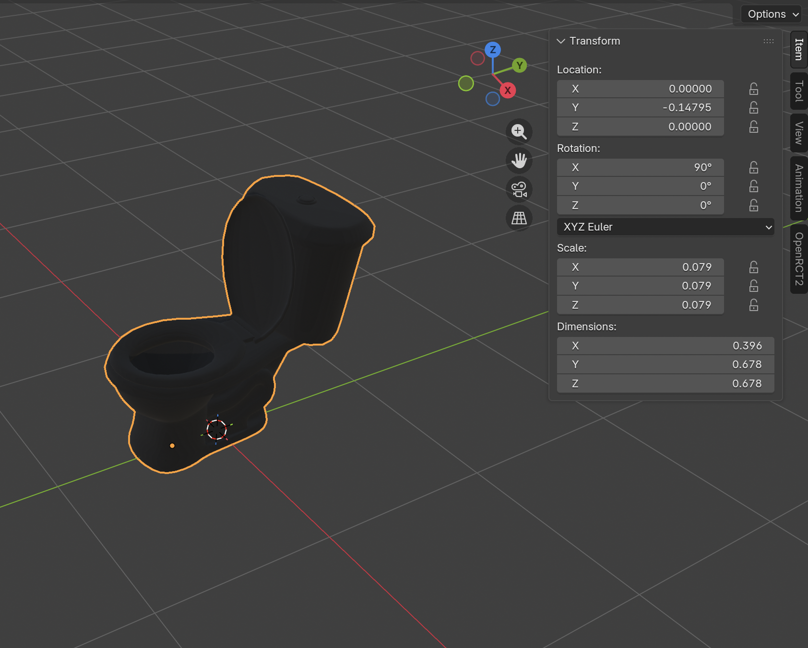

Next, we'll fix the color of the toilet materials. While the toilet is still selected, go back to the `OpenRCT2` tab in the N-Panel and go to the `Selected Object` panel.

You should see three materials. For each, in the `Shading` box, we'll want to just enable the `Color` option. This will override the materials color with the selection. Right now, the default white is a good choice. Do this for all three materials.

Then, press `Test Render` again, and your output should look like this instead:

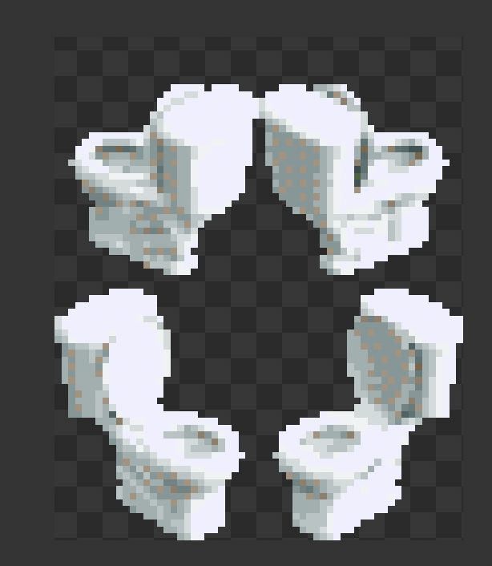

Looking much better! But it could be made even better by adjusting the material settings further.

Some good notes to keep in mind:

- Pure white and pure black are hard to render as much detail is lost due to the render scale and the basic material system currently supported by the X7 renderer. For white, try a darker shade, and for black, try a lighter shade.
- At this rendering scale, the specular exponent and intensity only affect small details, but playing with them can improve your results. It's more important to get the color and shading right.

### 6. Export and Try In-Game

Before exporting, I changed the color of each material to a slightly darker shade of white, `#BEBEBE`. I also enabled `Edge AA` for the toilet seat material `aiStandardSurface1SG` to give it a bit more definition against the base.

Press the `Export .parkobj` button, and then save the file to a known location. Then move this file into your OpenRCT2 objects folder.

- On macOS, this will be `~/Library/Application\ Support/OpenRCT2/object`

Launch the game, and it should be available as an option in the Object Selection menu.

I recommend having a scenario with every object enabled, so this way you can create a new 
game, immediately open the Object Selection menu, and see _only_ the new scenery object you added.

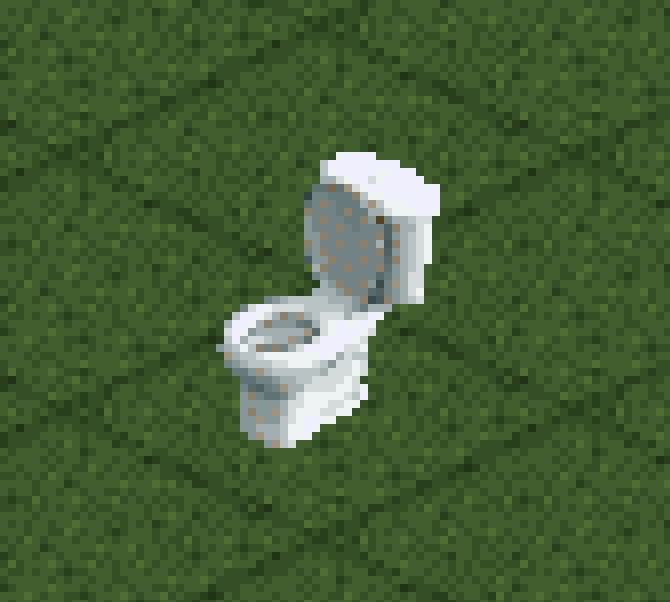

### 7. (Optional) Assign Remap Regions

Back in Blender, in the `Selected Object` panel, you can also assign a Remap region to a material. This will render the sprites with sprite groups that OpenRCT2 will replace with recolorable regions.

Remap1 maps to the first recoloring drop-down picker, Remap2 to the second, and Remap3 to the third.

The `Ai_Ceramic:Ai_CeramicSG` material corresponds to the toilet body, so we'll assign that `Remap1`. The `aiStandardSurface1SG` material correspond to the toilet seat, so we'll assign that `Remap2`. 

Press the `Test Render` button again, and your preview should look like this:

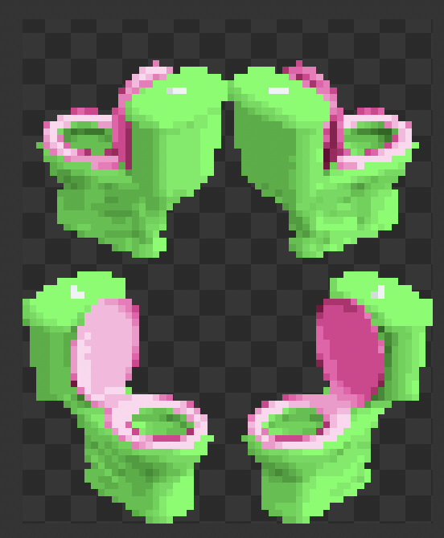

These wacky colors are what signals to OpenRCT2 to redraw them in custom colors. Export the `.parkobj` again, re-install it to OpenRCT2, and re-launch.

You should then be able to select the color of the toilet base and the toilet seat:

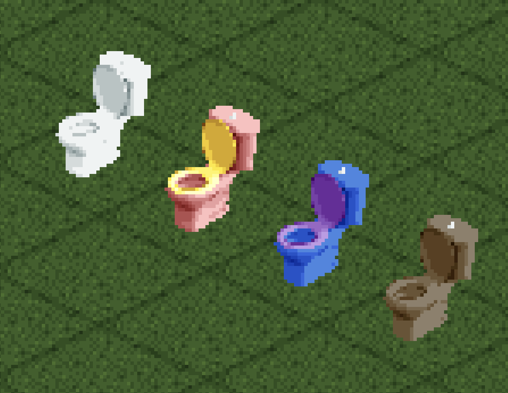

--- 

## Credit:

- For the toilet model: https://sketchfab.com/3d-models/toilet-c98c73d7b70e4635b8cc01705915aea6
  - by https://sketchfab.com/motaman (CC Attribution license)